## MEAN STACK PROJECT DEPLOYMENT

In this Practical implementation, we will build a working runtime environment for a MEAN stack project. MEAN stack comprises a JavaScript-based framework used to create web applications. The project which function is to collect the details of any book and display all registered books right underneath the registration form, uses MongoDB as it database, Express.js as it backend framework, Angular as it frontend framework, and Node.js is the runtime enviromemnt(server) for the application.

## MEAN comprises:
M - MongoDB (Document Database)
E - Express.js (JavaScript Backend Framework)
A - AngularJS (JavaScript Frontend Framework)
N - Node.js (JavaScript Runtime Environment)

<h3>Below  pictural representation of how MEAN stack works</h3>

<h3>Implementation Process</h3>

In this practical project, we will be using Amazon Elastic Cloud Compute (EC2) instance as our ubuntu Linux server. Also. we will connect to the server via SSH on Windows Terminal.

## Step 1: Node.js Set up

The first step after connecting the server to a terminal of your choice is to set up the NodeJS server which will serves as the runtime environment for our JavaScript project.

Update and upgrade the Ubuntu server 

	sudo apt update && sudo apt upgrade -y

Follow by installing Nodejs

	sudo apt install nodejs -y

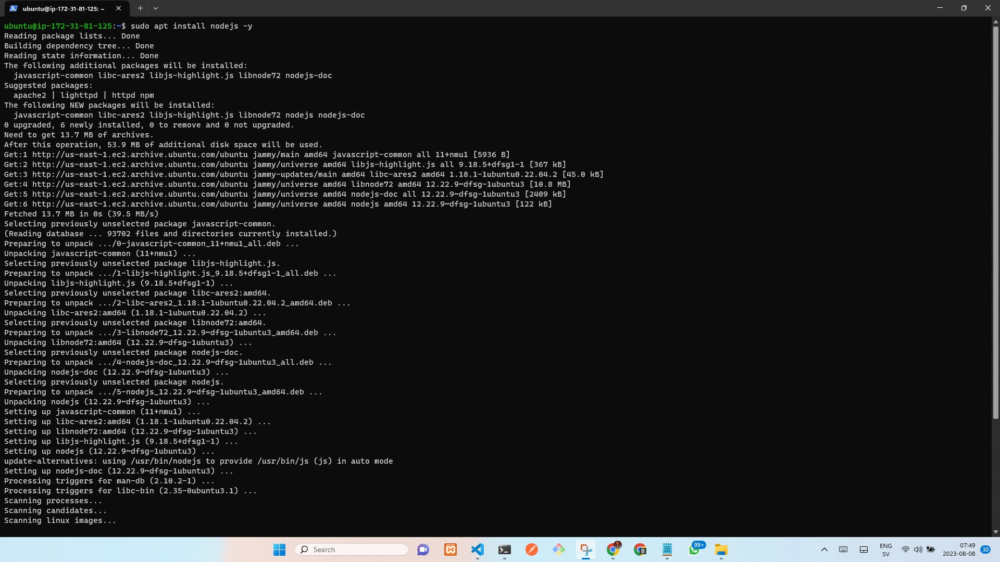

Now we will install the node package manager (npm)

	sudo apt install npm -y

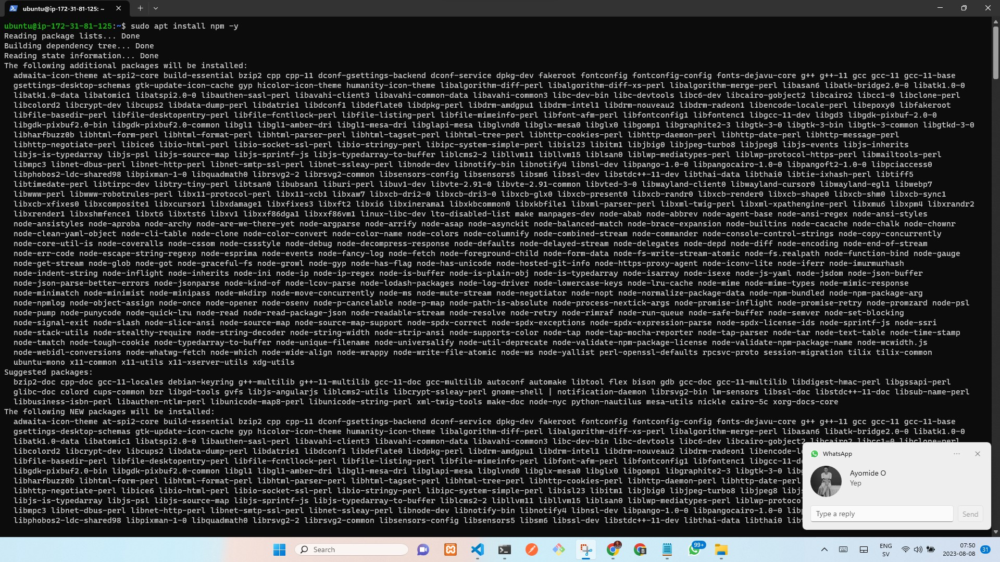

To verify installation of NodeJs, slimpply use the line below to check for the version installed

	node -v

and this for npm version

	npm --version

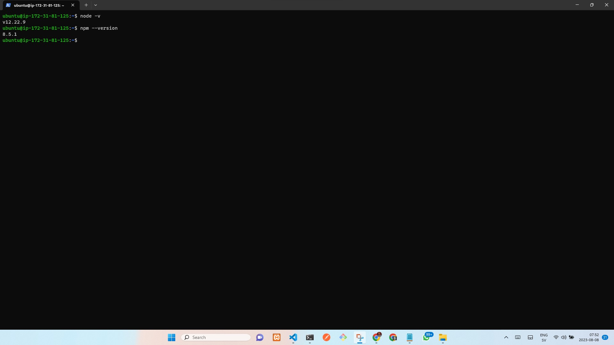

If version displayed is or below 12.     , there is a need to upgrade the version which most time "sudo apt update -y" does not resolve. so, there is need to install Node Package eXecute. it is a package runner which will allow us to execute any Javascript package available on the NPM registry without installing it.

	sudo npm install -g n 

Once thta is done, we need to upgrade to the latest version of node by simply running :

	n lts

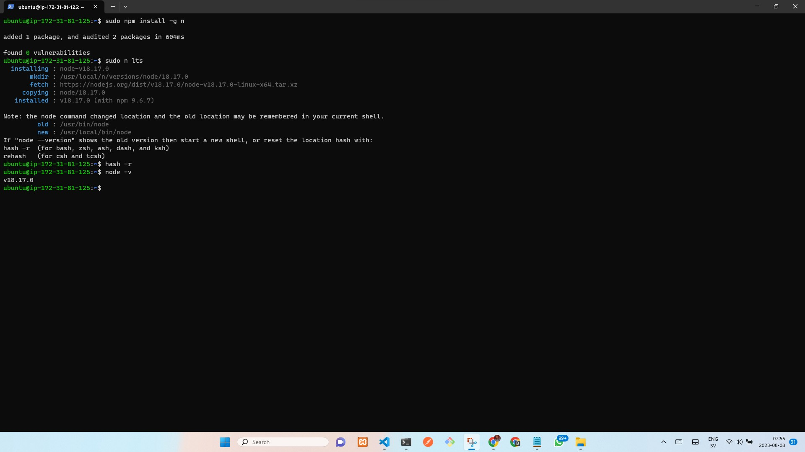

Now check the version once again and it is still the same, run the command bellow to reset hash cache

	hash -r

Follow by create a directory named 'Books' for the project, and navigating to the directory.

	Sudo mkdir Books && cd Books

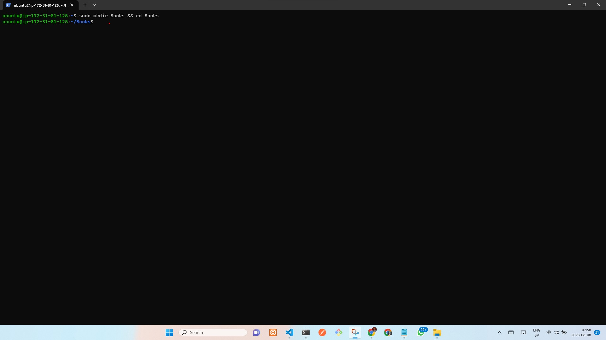

After the project root has been created, the next step is to initialize npm in the root (Boooks) directory. Ensure you set your entrypoint as server.js.

	npm init

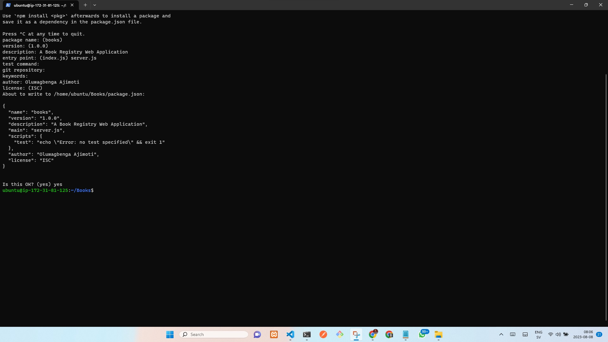

## Step 1: MongoDB Database Set up

From a terminal, install gnupg and curl if they are not already available:

	sudo apt-get install gnupg curl
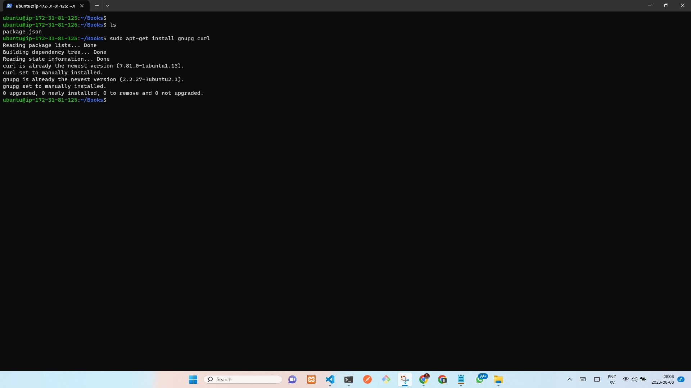

With the command below, we will import the MongoDB public GPG Key from https://pgp.mongodb.com/server-6.0.asc into our server

	curl -fsSL https://pgp.mongodb.com/server-6.0.asc | \
 	  sudo gpg -o /usr/share/keyrings/mongodb-server-6.0.gpg \
 	  --dearmor

With this, we will create the list file /etc/apt/sources.list.d/mongodb-org-6.0.list for your version of Ubuntu.

	echo "deb [ arch=amd64,arm64 signed-by=/usr/share/keyrings/mongodb-server-6.0.gpg ] https://repo.mongodb.org/apt/ubuntu jammy/mongodb-org/6.0 multiverse" | sudo tee /etc/apt/sources.list.d/mongodb-org-6.0.list

Now we neeed to reload the server

	sudo apt update 

Now, we need to install mongoDB since we have all it dependencies in olace.

	sudo apt-get install -y mongodb-org

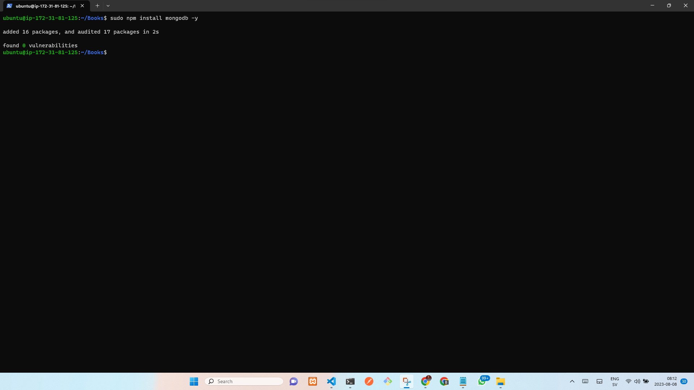
	
To verify the installation, we need to start it.

	sudo systemctl start mongod

And check it status 
    
    sudo systemctl status mongod

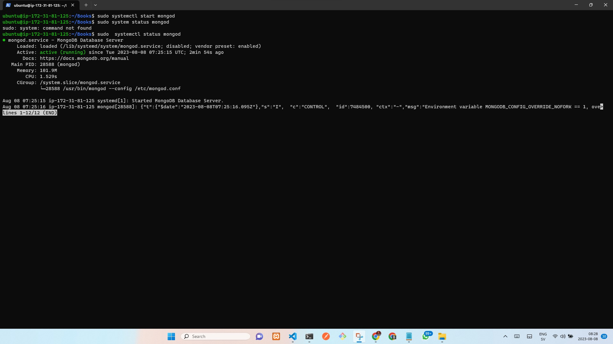

Lastly in this section, we need to create server.js file in the root directory which will serve as our entry point and copy the code into the server.js file.

	sudo nano server.js

server.js file

    var express = require('express');
    var bodyParser = require('body-parser');
    var app = express();
    app.use(express.static(__dirname + '/public'));
    app.use(bodyParser.json());
    require('./apps/routes')(app);
    app.set('port', 3300);
    app.listen(app.get('port'), function() {
        console.log('Server up: http://localhost:' + app.get('port'));
    });

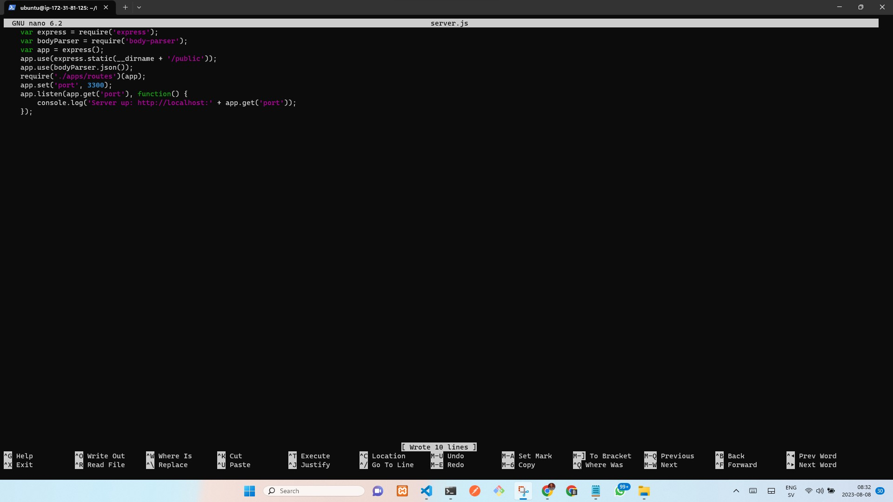

## EXPRESS.JS SET UP (BACKEND)

Express.js is the most popular and powerful backend framework of nodejs. It is responsible for building frame work for the application functionalities, and also help us to route tthe application with the database.

    sudo npm install express -y

We also will use Mongoose package which provides a straight-forward, schema-based solution to model your application data. We will use Mongoose to establish a schema for the database to store data of our book register.

    sudo npm install mongoose -y

   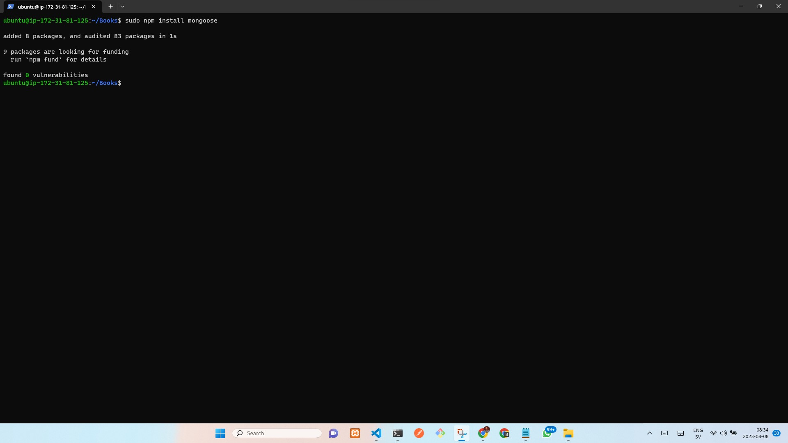

We need to install the body parser that will make the the server process JSON files

	sudo npm install body-parser

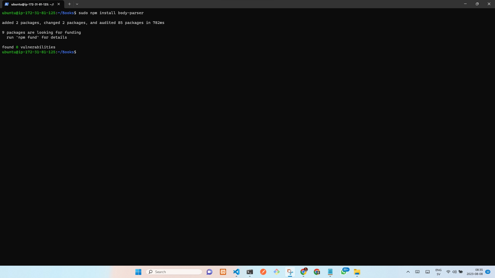

In the root directory, make a directory called apps and create a routes.js file in the apps directory.

    sudo mkdir apps && sudo touch apps/routes.js

Now, Open the routes.js file with your preferred editor.

    sudo vim apps/routes.js

Then, copy and paste the code below into the routes.js file

    var Book = require('./models/book');
    module.exports = function(app) {
    app.get('/book', function(req, res) {
        Book.find({}, function(err, result) {
        if ( err ) throw err;
        res.json(result);
        });
    }); 
    app.post('/book', function(req, res) {
        var book = new Book( {
        name:req.body.name,
        isbn:req.body.isbn,
        author:req.body.author,
        pages:req.body.pages
        });
        book.save(function(err, result) {
        if ( err ) throw err;
        res.json( {
            message:"Successfully added book",
            book:result
        });
        });
    });
    app.delete("/book/:isbn", function(req, res) {
        Book.findOneAndRemove(req.query, function(err, result) {
        if ( err ) throw err;
        res.json( {
            message: "Successfully deleted the book",
            book: result
        });
        });
    });
    var path = require('path');
    app.get('*', function(req, res) {
        res.sendfile(path.join(__dirname + '/public', 'index.html'));
    });
    };

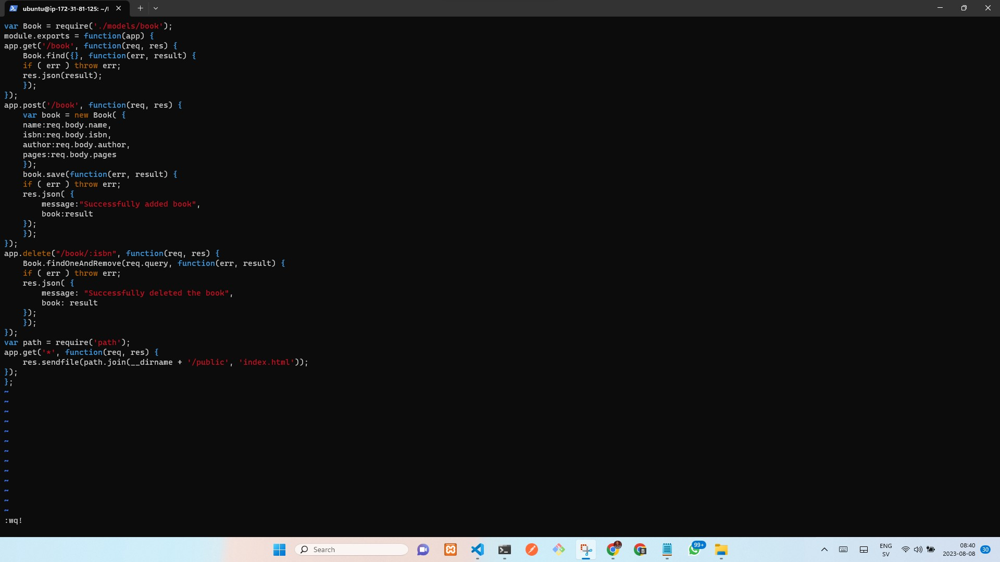

In the apps directory, make a new directory called models and create book.js file in it

    sudo mkdir apps/models && sudo touch apps/models/book.js

Open the book.js file with your preferred editor

    sudo nano apps/models/book.js

Then copy and paste the below code into it.

    var mongoose = require('mongoose');
    var dbHost = 'mongodb://localhost:27017/test';
    mongoose.connect(dbHost);
    mongoose.connection;
    mongoose.set('debug', true);
    var bookSchema = mongoose.Schema( {
    name: String,
    isbn: {type: String, index: true},
    author: String,
    pages: Number
    });
    var Book = mongoose.model('Book', bookSchema);
    module.exports = mongoose.model('Book', bookSchema);

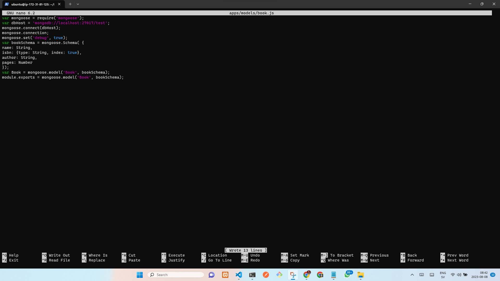

## FRONTEND INTERFACE SETUP

Augular is one of the popular and mostly used JavaScript User interface framework. It will provide already built structure for our aåplication web app.
To get started with this, we have to ensure that we are in the application root directory, which is the books directory.

Make a diectory with the name public and create script.js file in it.

    sudo mkdir public && sudo touch public/script.js

Open the script.js file with your preferred editor

    sudo vim public/script.js

Then copy and paste the code below:

    var Book = require('./models/book');
    module.exports = function(app) {
    app.get('/book', function(req, res) {
        Book.find({}, function(err, result) {
        if ( err ) throw err;
        res.json(result);
        });
    }); 
    app.post('/book', function(req, res) {
        var book = new Book( {
        name:req.body.name,
        isbn:req.body.isbn,
        author:req.body.author,
        pages:req.body.pages
        });
        book.save(function(err, result) {
        if ( err ) throw err;
        res.json( {
            message:"Successfully added book",
            book:result
        });
        });
    });
    app.delete("/book/:isbn", function(req, res) {
        Book.findOneAndRemove(req.query, function(err, result) {
        if ( err ) throw err;
        res.json( {
            message: "Successfully deleted the book",
            book: result
        });
        });
    });
    var path = require('path');
    app.get('*', function(req, res) {
        res.sendfile(path.join(__dirname + '/public', 'index.html'));
    });
    };

In that same public folder/directory, create index.thml file

    sudo nano public/index.html

Then, copy and paste the code below into it;

    <!doctype html>
    <html ng-app="myApp" ng-controller="myCtrl">
    <head>
        
        
    </head>
    <body>
        

        <table>
            <tr>
            <td>Name:</td>
            <td><input type="text" ng-model="Name"></td>
            </tr>
            <tr>
            <td>Isbn:</td>
            <td><input type="text" ng-model="Isbn"></td>
            </tr>
            <tr>
            <td>Author:</td>
            <td><input type="text" ng-model="Author"></td>
            </tr>
            <tr>
            <td>Pages:</td>
            <td><input type="number" ng-model="Pages"></td>
            </tr>
        </table>
        <button ng-click="add_book()">Add</button>
        

        

        

        <table>
            <tr>
            <th>Name</th>
            <th>Isbn</th>
            <th>Author</th>
            <th>Pages</th>

            </tr>
            <tr ng-repeat="book in books">
            <td>{{book.name}}</td>
            <td>{{book.isbn}}</td>
            <td>{{book.author}}</td>
            <td>{{book.pages}}</td>

            <td><input type="button" value="Delete" data-ng-click="del_book(book)"></td>
            </tr>
        </table>
        

    </body>
    </html>

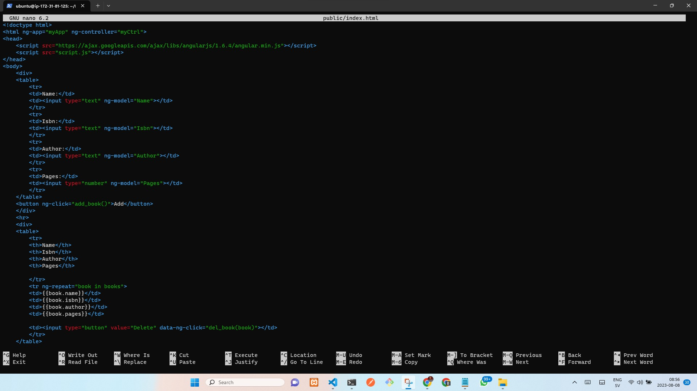

Now, our application contents are in palce, and we need to lauch our server. Ensure you are in the application root directory before implementing the next command.

    node server.js

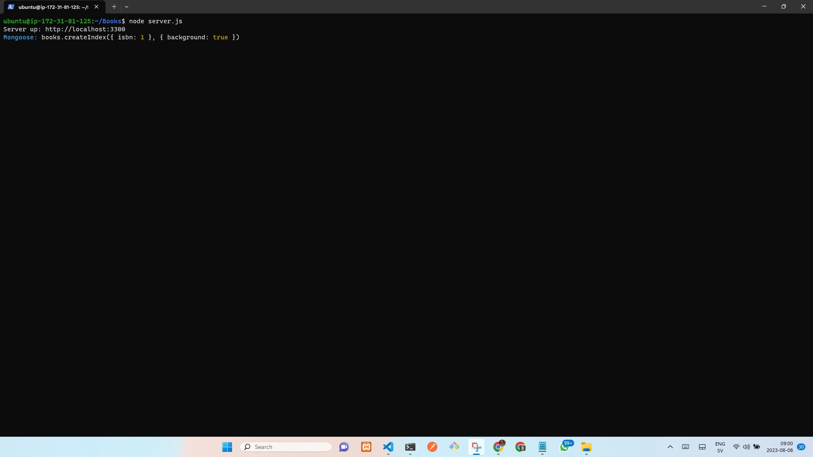

With the commond below, we have a glimpse of the all application output through another terminal.

    curl -s http://localhost:3300

From the prompt, our server is running on port 3300, we need to edit our EC2 instance security group to allow traffic form port 3300. This will allow the appliaction to be accessible via any browser.

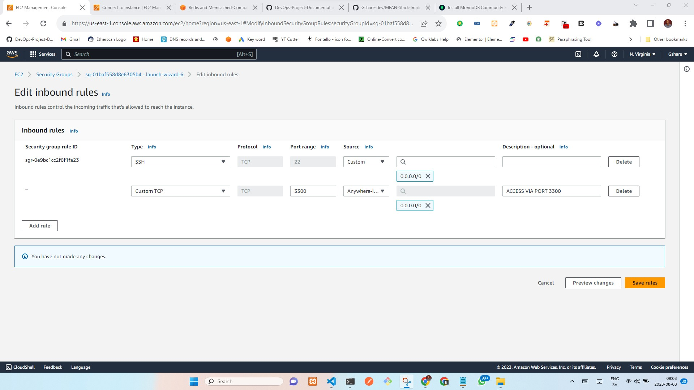

Now our Book Register applicaton is accessible from the Internet with a browser using Public IP address or Public DNS name with port3300.

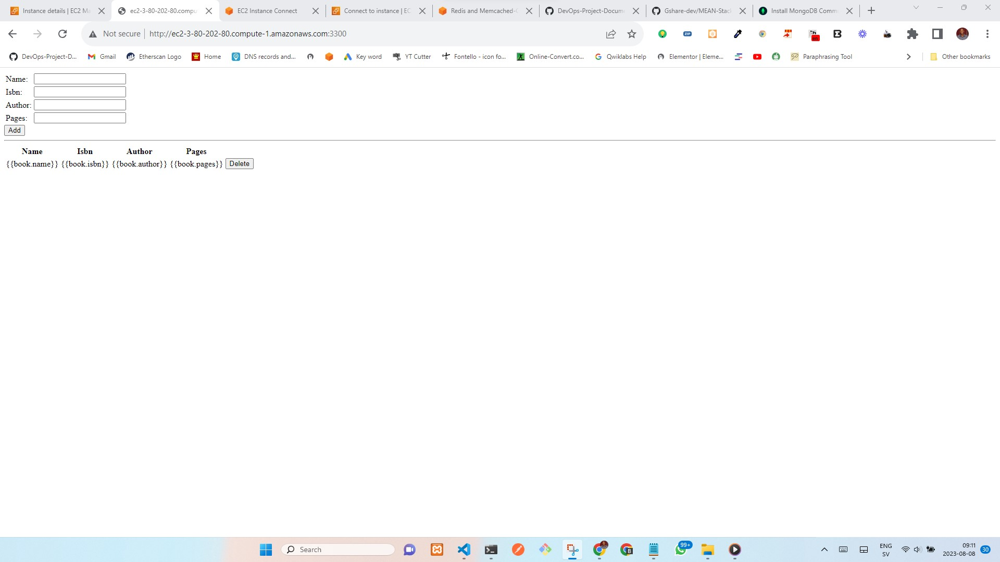

<h3>You have now successfull created an infrastructure to host a MEAN stack project. Congratulation!</h3>